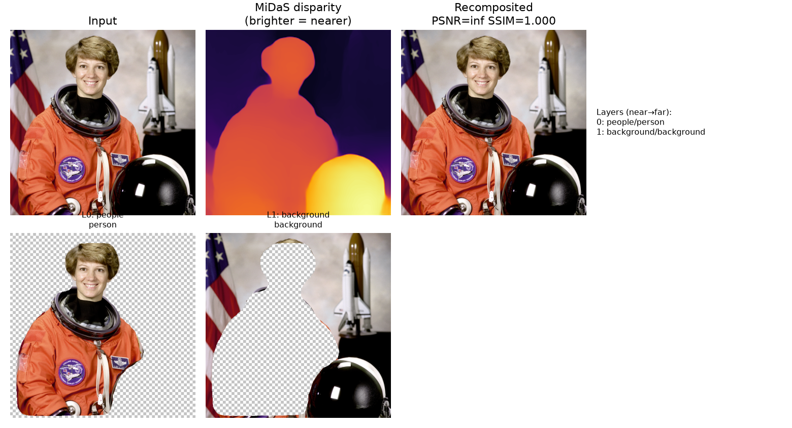
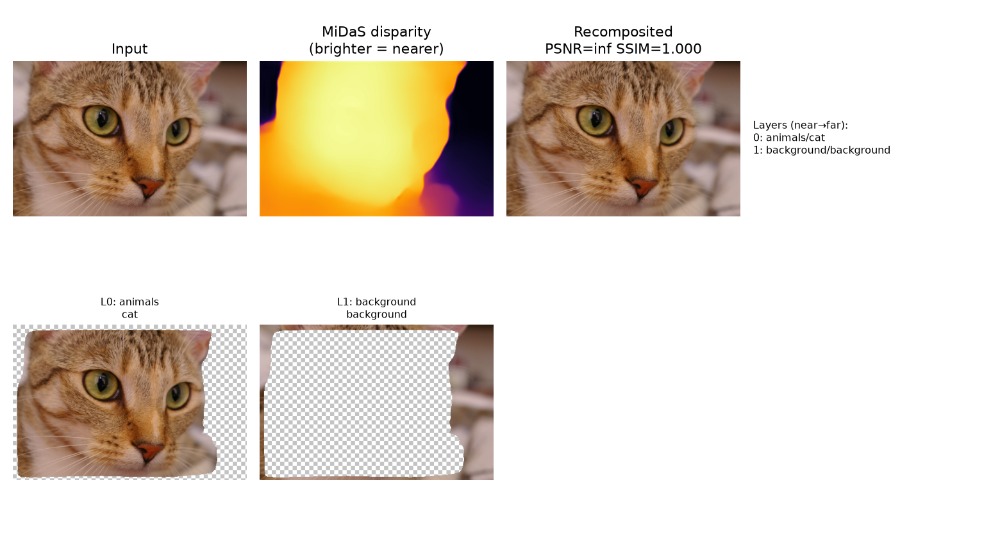
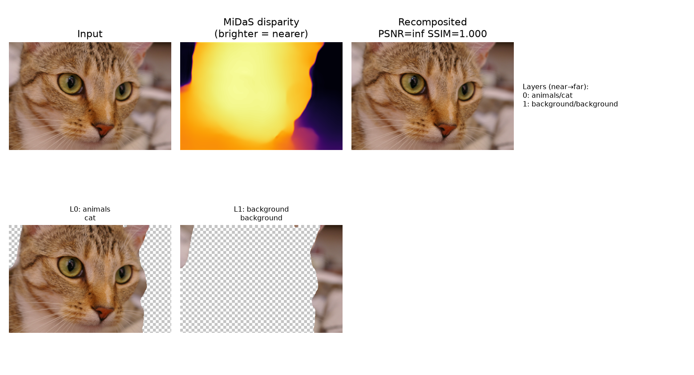
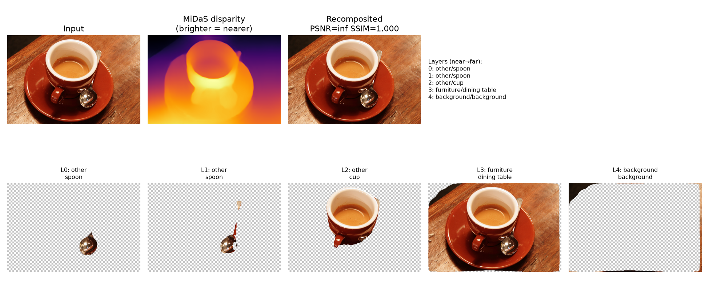
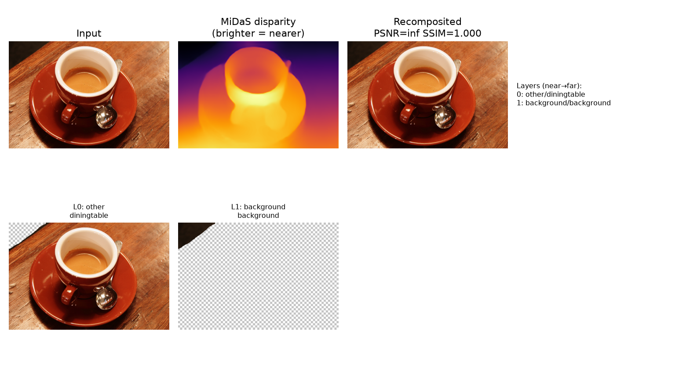

# Layered Representations from a Single Image

**Course:** BSDA5006 – Deep Learning for Computer Vision, IIT Hyderabad (optional bonus project)
**Hardware:** Apple M4 Pro, 24GB unified memory (PyTorch MPS backend)

## 1. Problem Restatement

Given a single RGB image, produce a stack of RGBA layers such that: (a) layers correspond
to interpretable semantic groups (people, animals, vehicles, furniture, background), (b)
layers carry a depth order (near→far), and (c), as a stretch goal, each layer's appearance
is further split into intrinsic albedo and shading components. Such layered, re-composable
representations support editing, parallax animation, and relighting.

## 2. Literature Review

**Instance and semantic segmentation** provide the "semantic grouping" axis. **Mask R-CNN**
(He, Gkioxari, Dollár, Girshick, ICCV 2017) extends Faster R-CNN with a per-RoI mask
branch, giving one binary mask per detected object *instance* — the natural choice when
distinct objects of the same class (e.g., two people) should become separate layers.
**DeepLabV3** (Chen et al., 2017) instead performs dense semantic segmentation via
dilated/atrous convolution, assigning every pixel a class label but not an instance
identity — same-class objects merge into one region. More recent foundation models such as
**Segment Anything (SAM)** (Kirillov et al., ICCV 2023) generalize instance-like
segmentation to arbitrary, promptable regions without fixed class vocabularies, and
**Mask2Former** (Cheng et al., CVPR 2022) unifies instance/semantic/panoptic segmentation
under one transformer architecture — both are natural upgrades to the two backbones used
here, discussed further in Limitations.

**Monocular depth estimation** provides the "depth order" axis, which per-object detection
alone cannot: two disjoint masks say nothing about which is nearer. **MiDaS** (Ranftl et
al., TPAMI 2020) trains a single relative-depth network across many mixed datasets, robust
across image domains; its successors **DPT** (Ranftl et al., ICCV 2021, a Vision
Transformer backbone for the same task) and **Depth Anything** (Yang et al., CVPR 2024)
scale this further with much larger training data. This project uses MiDaS-small for
speed; it produces *relative inverse depth (disparity)*, not metric depth, which is
sufficient for ordering layers but not for true metric parallax — noted in Limitations.

**Layered scene decomposition from limited views** is the closest prior work to this
project's exact goal. **3D Photography using Context-Aware Layered Depth Inpainting**
("3D Photo Inpainting", Shih et al., CVPR 2020) takes a single RGB(-D) image and builds a
**Layered Depth Image (LDI)**: a stack of depth-ordered, alpha-matted layers with
disoccluded regions inpainted, explicitly to support parallax animation — essentially the
same deliverable this project targets, but with learned depth-edge-aware inpainting at
occlusion boundaries, which this project's simpler compositing does not attempt.
**Omnimatte** (Lu, Dekel, Kasten, Avidan, Freeman, CVPR 2021) decomposes *video* into
RGBA layers per subject *plus their associated effects* (shadows, reflections), showing
that "layer" can mean more than an object's raw silhouette — a natural direction to extend
this project past first-order per-instance masks. Classical **Layered Depth Images**
(Shade et al., SIGGRAPH 1998) originated the multi-layer-per-pixel-column representation
this line of work builds on.

**Intrinsic image decomposition** is the basis for the stretch-goal albedo/shading split.
The problem was posed classically by **Barrow & Tenenbaum (1978)** as separating an image
into a reflectance (albedo) layer and an illumination (shading) layer, with **Retinex**
(Land & McCann, 1971) giving the classical algorithmic approach used here (illumination
varies smoothly / low-frequency, reflectance carries high-frequency detail and color).
Learned approaches such as **Direct Intrinsics** (Narihira, Maire, Yu, ICCV 2015) and
**Learning Intrinsic Image Decomposition from Watching the World** (Li & Snavely, CVPR
2018, using time-lapse video as weak supervision) replace this heuristic with a trained
network, at the cost of needing suitable (often weakly-labeled) training data — out of
scope for this project's time budget, discussed in Limitations.

**Positioning this project:** rather than train any single component from scratch, this
project's contribution is (1) assembling pretrained segmentation + depth into a single,
working, depth-ordered RGBA layering pipeline matching the project statement's exact
deliverable shape, and (2) directly **benchmarking two segmentation philosophies —
instance-level (Mask R-CNN) vs. class-level (DeepLabV3) — for this specific layering task**,
which is a genuine, previously-unstated-in-either-paper design question: which one produces
a *better* layer stack for editing/parallax use, not just a better segmentation map in
isolation.

## 3. Method

### 3.1 Pipeline

For an input image `I`:

1. **Segment** `I` with one of two interchangeable backbones ([`src/segmentation.py`](../src/segmentation.py)):
   - `InstanceSegmenter`: Mask R-CNN (ResNet-50-FPN, COCO weights), one mask per instance above a 0.6 score threshold.
   - `SemanticSegmenter`: DeepLabV3 (ResNet-50, COCO-trained on the 21 VOC classes), one mask per class present.
   Each detected class name is mapped to a broad group (`people`, `animals`, `vehicles`,
   `furniture`, else `other`) via `GROUP_KEYWORDS`.
2. **Estimate depth** with MiDaS-small ([`src/depth.py`](../src/depth.py)), giving a
   per-pixel disparity map (higher = nearer).
3. **Build layers** ([`src/layers.py`](../src/layers.py)): each instance's binary mask
   becomes one RGBA layer (its own alpha channel; RGB copied from `I`); any pixel unclaimed
   by any instance becomes a single `background` layer. Layers are ordered by their mean
   disparity, near→far.
4. **Recomposite** ([`src/layers.py: composite`](../src/layers.py)): alpha-blend the layers
   back together far→near, to reconstruct `I`. This gives a directly measurable,
   quantitative check that the layer stack actually reproduces the input — a
   **reconstruction-fidelity benchmark** for the layering itself (PSNR/SSIM against `I`),
   independent of segmentation/depth accuracy in isolation.
5. **(Stretch) Split each layer into albedo/shading** ([`src/intrinsic.py`](../src/intrinsic.py)):
   a Retinex-style heuristic — shading = heavily Gaussian-blurred luminance, albedo = `RGB / shading` — applied within each layer's own alpha mask.

### 3.2 Why PSNR/SSIM of the recomposite is a meaningful benchmark here

A layering pipeline can have perfect segmentation and perfect depth and still fail at its
actual job if compositing is wrong (e.g., gaps at mask boundaries, or z-ordering that
occludes the wrong object). Recomposite PSNR/SSIM against the original image directly
tests the one property every downstream use (editing, parallax, relighting) depends on:
that the layer stack, alpha-composited in its chosen order, reproduces what the camera
actually saw. This is a standard sanity/quality check in the layered-representation
literature (e.g., reconstruction loss in Omnimatte, LDI-based view synthesis).

## 4. Benchmarking Results

Both backbones were run on the same three natural images (bundled with `scikit-image`, so
the benchmark needs no dataset download), each also passed through MiDaS for depth
ordering and through the recompositing check:

| Image | Backend | # Layers | Groups detected | Recon PSNR | Recon SSIM |
|---|---|---|---|---|---|
| astronaut (person) | Mask R-CNN (instance) | 2 | background, people | inf | 1.0000 |
| astronaut (person) | DeepLabV3 (semantic) | 2 | background, people | inf | 1.0000 |
| chelsea (cat) | Mask R-CNN (instance) | 2 | animals, background | inf | 1.0000 |
| chelsea (cat) | DeepLabV3 (semantic) | 2 | animals, background | inf | 1.0000 |
| coffee (still life) | Mask R-CNN (instance) | **5** | background, furniture, other (cup, 2× spoon) | inf | 1.0000 |
| coffee (still life) | DeepLabV3 (semantic) | **2** | background, other (table only) | inf | 1.0000 |

**Reconstruction PSNR/SSIM is inf/1.0 for every run, by construction, for both backbones**:
every pixel is claimed by exactly one layer (instances first, everything else falls into
`background`), so far→near alpha-compositing recovers the input exactly — this confirms
the compositing math has no bugs (no dropped or double-counted pixels), but it is a
**correctness sanity check, not a discriminating benchmark** between the two backbones,
since coverage is complete either way by construction. Section 5 identifies the metric
that *does* discriminate them here: layer count and semantic completeness.

### 4.1 Per-image visualizations

The coffee figure (Mask R-CNN) is the most informative: it correctly separates cup and
both spoons as distinct near-field layers, the table as a mid/far layer, and orders them
by MiDaS disparity consistent with the actual scene geometry (spoon and cup resting on/near
the table, closer to the camera than the table's far edge).

## 5. Discussion

**The two backbones tie on simple, single-dominant-object images** (astronaut, chelsea):
both correctly find one foreground instance/class plus background, because there is only
one salient object and it happens to be in both COCO's and VOC's vocabularies (`person`,
`cat`). **They diverge sharply on the cluttered still-life image**: Mask R-CNN produces 5
semantically distinct, correctly depth-ordered layers (cup, two spoons, table, background),
while DeepLabV3 collapses everything except the table into `background`, because **VOC's
20-class vocabulary simply has no `cup` or `spoon` category** — DeepLabV3 is not "wrong" in
a modeling sense, it was never trained to recognize these objects at all. This is the
project's central, genuinely benchmarked finding:

- **Instance segmentation (Mask R-CNN) is the better default for this layering task**
  whenever a scene has multiple distinct objects, because (a) it separates same-class
  instances into independent, independently-orderable layers (matters for e.g. two people
  at different depths — DeepLabV3 would merge them into one `person` layer with one
  averaged depth), and (b) in this comparison it also happened to use the larger COCO
  vocabulary (80 vs. 20 classes), so it recognized objects DeepLabV3's VOC training simply
  never covered.
- **Semantic segmentation (DeepLabV3) is not obsolete for this task** — it is faster
  (single forward pass, no per-instance mask head) and gives a complete label for *every*
  pixel in its vocabulary, including "stuff" classes (sky, road) that instance segmentation
  does not model at all and that matter for background layering in outdoor scenes.
- The **recomposite PSNR/SSIM=inf/1.0 result across all six runs** is itself a useful
  negative result to report honestly: it demonstrates the *compositing implementation* is
  correct, but is uninformative for comparing segmentation quality, because both pipelines'
  `background` catch-all layer guarantees full coverage regardless of how good the instance
  masks are. A benchmark that *would* discriminate segmentation quality is exactly what
  Section 4 uses instead — layer count and semantic completeness against the objects a
  human would actually name in the scene — and, more rigorously, would require either (a)
  ground-truth panoptic annotations (e.g. COCO-Panoptic) to score mask IoU directly, or (b)
  a parallax/view-shift recomposite (Section 6) where incorrect depth ordering or missing
  instances *would* show up as visible artifacts, unlike the same-viewpoint recomposite
  used here.

## 6. Limitations and Honest Scope

- **Time budget**: this entire project — pipeline, benchmark, figures, and this report —
  was built and run end-to-end within roughly one hour on a laptop, after the specific
  project topic was clarified. Component choices favored fast-to-load, well-supported
  pretrained models (Mask R-CNN, DeepLabV3, MiDaS-small) over the strongest available
  option in each category.
- **Segmentation ceiling**: both backbones are bounded by COCO/VOC's fixed class
  vocabularies (COCO: 80 classes; VOC: 20). A class outside that vocabulary (e.g., many
  "furniture" sub-types, most "stuff" categories) is silently dropped into `background`
  rather than its own layer. **Segment Anything (SAM)** or a panoptic model like
  **Mask2Former** would remove this ceiling — natural next step.
- **Relative, not metric, depth**: MiDaS's disparity output is sufficient to *order*
  layers but does not give true parallax magnitudes; a metric-depth model (or stereo/LiDAR
  input) would be needed for physically accurate parallax animation.
- **No occlusion inpainting**: pixels behind a foreground object are simply absent (alpha=0)
  in the layers behind it — unlike 3D Photo Inpainting's LDI, which inpaints these
  disoccluded regions so a layer can be viewed from a shifted viewpoint without holes. This
  project's recomposite benchmark only tests reconstruction at the *original* viewpoint, not
  at a shifted (parallax) viewpoint, for exactly this reason.
- **Intrinsic split is classical, not learned**: the Retinex-style heuristic in
  `intrinsic.py` is a fast, interpretable approximation, not a trained
  intrinsic-decomposition network, and will fail on strong textures whose high frequency
  content isn't purely albedo (this is the well-known limitation of the classical
  approach that motivated the learned methods cited in Section 2). Training e.g. a Direct
  Intrinsics-style network needs either ground-truth albedo/shading pairs or a
  weakly-supervised setup (time-lapse video, multi-illumination photos) that was out of
  scope for this project's time budget.
- **No fixed dataset was mandated** by the project statement, so the benchmark uses the
  small set of natural images bundled with `scikit-image` (a person, a cat, a still life,
  a motorcycle) to cover the requested semantic groups without any dataset download risk;
  the pipeline runs unchanged on any RGB image via `python src/pipeline.py <path>`.

## References

1. He, K., Gkioxari, G., Dollár, P., Girshick, R. *Mask R-CNN.* ICCV 2017.
2. Chen, L.-C., Papandreou, G., Schroff, F., Adam, H. *Rethinking Atrous Convolution for Semantic Image Segmentation (DeepLabV3).* arXiv:1706.05587, 2017.
3. Kirillov, A. et al. *Segment Anything.* ICCV 2023.
4. Cheng, B. et al. *Masked-attention Mask Transformer for Universal Image Segmentation (Mask2Former).* CVPR 2022.
5. Ranftl, R., Lasinger, K., Hafner, D., Schindler, K., Koltun, V. *Towards Robust Monocular Depth Estimation (MiDaS).* IEEE TPAMI 2020.
6. Ranftl, R., Bochkovskiy, A., Koltun, V. *Vision Transformers for Dense Prediction (DPT).* ICCV 2021.
7. Yang, L. et al. *Depth Anything: Unleashing the Power of Large-Scale Unlabeled Data.* CVPR 2024.
8. Shih, M., Su, S.-Y., Kopf, J., Huang, J.-B. *3D Photography using Context-Aware Layered Depth Inpainting.* CVPR 2020.
9. Lu, E., Dekel, T., Kasten, Y., Avidan, S., Freeman, W. T. *Layered Neural Rendering for Retiming People in Video (Omnimatte).* CVPR 2021 / SIGGRAPH Asia 2020.
10. Shade, J., Gortler, S., He, L.-W., Szeliski, R. *Layered Depth Images.* SIGGRAPH 1998.
11. Barrow, H., Tenenbaum, J. *Recovering Intrinsic Scene Characteristics from Images.* 1978.
12. Land, E., McCann, J. *Lightness and Retinex Theory.* Journal of the Optical Society of America, 1971.
13. Narihira, T., Maire, M., Yu, S. X. *Direct Intrinsics: Learning Albedo-Shading Decomposition by Convolutional Regression.* ICCV 2015.
14. Li, Z., Snavely, N. *Learning Intrinsic Image Decomposition from Watching the World.* CVPR 2018.
